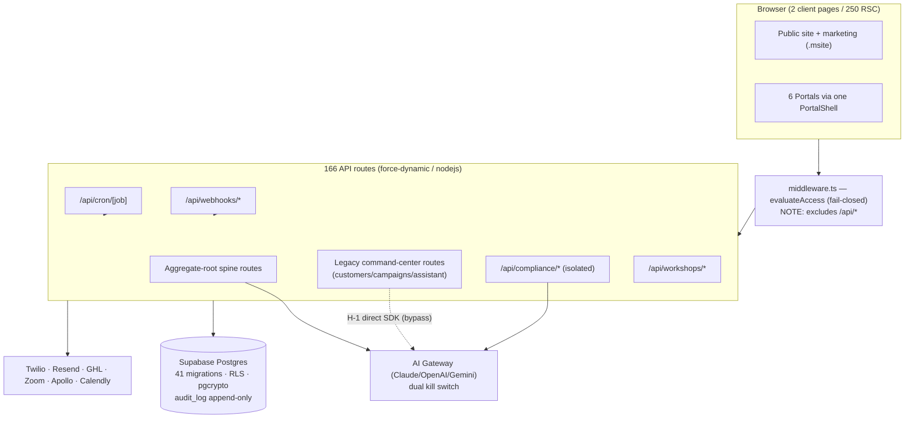
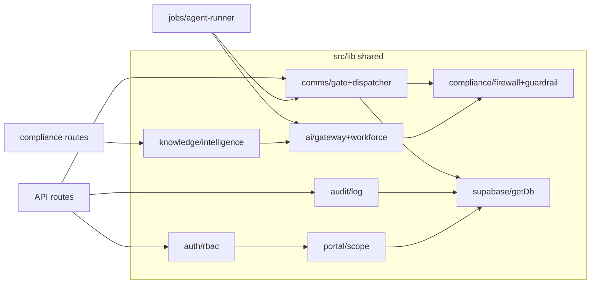
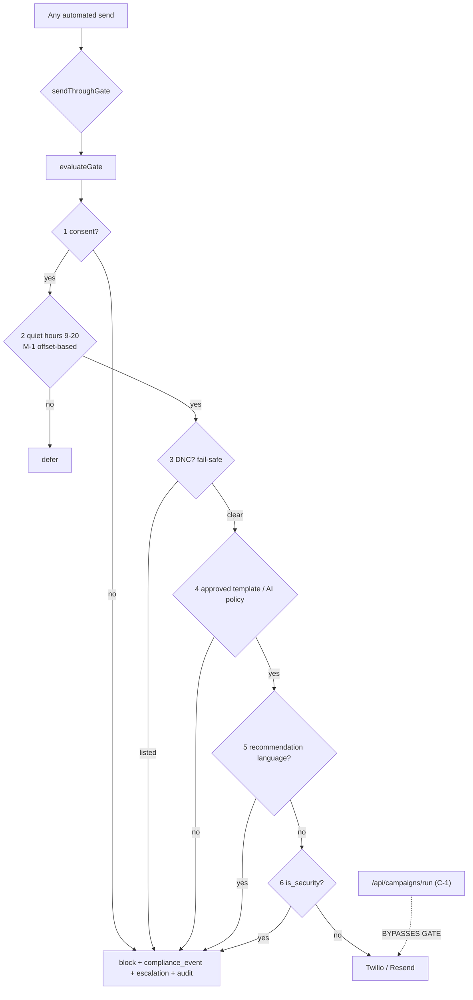
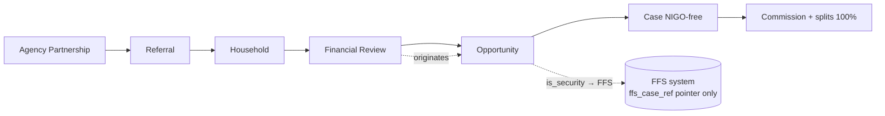
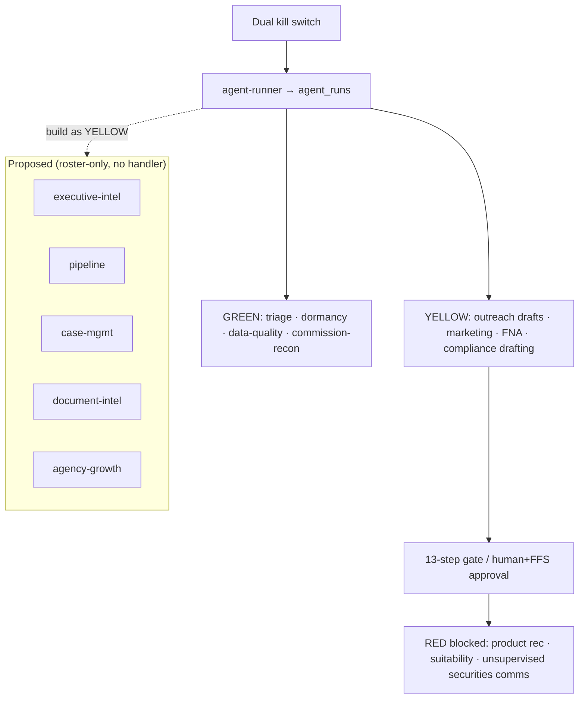
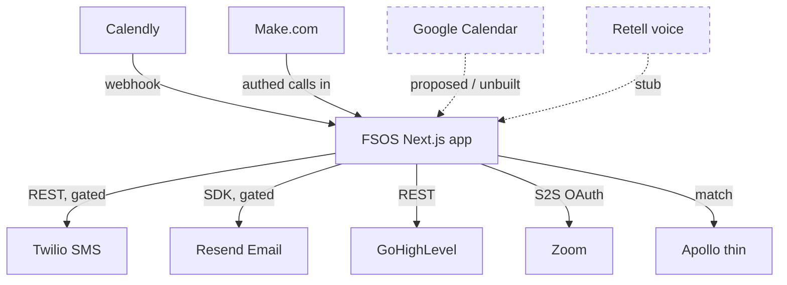
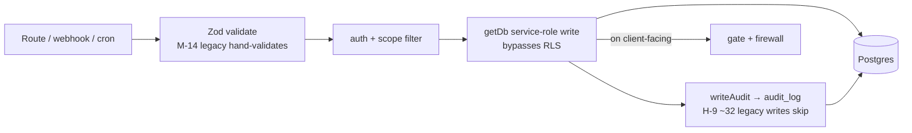

# FSOS Enterprise Architecture Audit — Phase 1 (Findings & Roadmap)

> **Status: READ-ONLY audit deliverable.** No code, schema, config, or skill was
> modified to produce this document. This is the input to a sequenced
> transformation, to be approved before any implementation begins.
>
> **Repo:** `AutolenisWebDeveloper/FSOS` · **Live:** https://www.markistfsa.com/app
> **Audited HEAD:** `7d2d44d` (branch `claude/fsos-enterprise-audit-phase-1-3t8u3k`)
> **Date:** 2026-07-21 · **Authority order applied:** fsos-dev → CLAUDE.md → existing implementation → project skills → general knowledge.
> **Method:** 9 parallel read-only explorer agents across data/RLS, auth/RBAC, API/webhooks,
> comms gate, AI/jobs, Compliance Intelligence, workshops, UI/design, and integrations/security;
> every claim below is traced to a file path + line, and critical compliance claims were
> re-verified directly against current `HEAD`.

---

## 0. Executive summary

FSOS is **not greenfield and not a generic CRM** — it is a substantial, largely mature
financial-services operating system: **166 API routes, 252 pages (250 server components),
41 migrations, 20 behavioral test suites, 6 authenticated portals + a public surface, one
unified Next.js 15 app.** The aggregate-root spine (Agency Partnership → Referral →
Household → Review → Opportunity → Case → Commission) is implemented exactly as specified,
with a genuinely disciplined design-token system, a pure/tested 13-step communications gate (`data-guardrails.md` §5),
an append-only tamper-evident `audit_log`, pgcrypto DOB encryption, a model-agnostic AI
gateway with a dual kill switch, and a correctly-isolated Compliance Intelligence module.

**The dominant architectural fact is that FSOS is effectively two codebases:** a
disciplined, guardrailed **aggregate-root spine** (migrations 009+) sitting beside a
**legacy command-center layer** (`customers`/`policies`/`campaigns`/`assistant`, migrations
001–008) that predates the guardrails and violates several of them. Most of the highest-risk
findings live on the legacy seam. **A prior internal audit already exists**
(`docs/superpowers/plans/2026-07-19-fortune500-readiness.md`); this audit reconciles against
it and finds several of its Phase-0 items **already remediated** (CI added, internal auth now
fails closed, silent-skip tests hardened) while its **single most severe finding — the
campaign cron bypassing the compliance gate — is still live.**

**Posture recommendation: extend, do not rewrite.** Nothing in the spine is unsalvageable.
The correct program is (1) close the remaining live compliance/PII holes on the legacy seam,
(2) collapse the gateway/firewall bypass paths, (3) then layer the product vision (comms
command center, AI workforce depth, acquisition engine, MCP, redesign) onto the existing
architecture as independent, individually-reviewable initiatives.

---

## Skill & capability status (printed per request — nothing installed)

| Skill | Status | Notes |
|---|---|---|
| `fsos-dev` | ✅ Installed (loaded, authority #1) | **Stale prose:** says "Next.js 14" and root `/home/claude/fsos/`; code is Next.js 15.5.18 at `/home/user/FSOS`. Flagged as doc-vs-code (§ below). |
| `frontend-design` | ✅ Installed | Aesthetic direction skill. |
| `Impeccable` (`impeccable`) | ✅ Installed | UI design/redesign/audit; `DESIGN.md`/`PRODUCT.md` were generated by its `document` workflow. |
| `Superpowers` | ✅ Installed (framework) | Present sub-skills: brainstorming, writing-plans, executing-plans, subagent-driven-development, test-driven-development, systematic-debugging, verification-before-completion, requesting/receiving-code-review, using-git-worktrees, dispatching-parallel-agents, finishing-a-development-branch, writing-skills, using-superpowers. |
| FSOS project skills | ✅ All installed | `fsos-crm-workflows`, `fsos-nigo-intelligence`, `fsos-security-audit`, `farmers-brand-website`, `finra-rule-ingestion`, `rightbridge-pdf-analysis`, `twilio-a2p-compliance`. |
| Supporting | ✅ Installed | `supabase`, `supabase-postgres-best-practices`. |

**No capability was missing that blocked the audit. Nothing was installed.** MCP servers
seen in-session (Supabase, Twilio, GHL-adjacent, Vercel, GitHub, Make, Apollo, Google
Calendar/Gmail/Drive, Docusign, Zapier, Canva, etc.) are classified in §8 — **not installed
or invoked**, per the read-only mandate. The `twilio` MCP server requires OAuth and is
**unauthenticated in this session** (cannot be used until the user authorizes it interactively).

---

## 1. What EXISTS and works (do not rebuild)

Cited so nothing already-built gets re-scaffolded.

### 1.1 Aggregate-root spine — complete and spec-accurate
`supabase/migrations/009_aggregate_root_core.sql` builds the entire spine in dependency
order: `agency_partnerships` (`:40`, root) → `referrals` (`:113`) → `households` (`:84`) →
`reviews` (`:224`, first-class; `outcome jsonb "records NEEDS, never a recommendation"`) →
`opportunities` (`:242`) → `cases` (`:271`, NIGO-free) → `commissions` (`:312`). FK chain
intact; `commission_splits` enforces `check (fsa_split_pct + agency_split_pct = 100)` (`:309`).
The UI is aggregate-root-first: `src/app/(fsa)/app/agencies/page.tsx:11` selects from
`agency_partnerships`, self-described as *"the aggregate root of FSOS."* This is domain-modeled,
**not** a repurposed contact-deal CRM.

### 1.2 The three guardrails — enforced in code, not just documented
- **Securities firewall.** `is_security boolean not null default false` on every
  securities-touching table (`products` 009:175, `household_policies` 009:204, `opportunities`
  009:253, `cases` 009:278, `commissions` 009:317, `opra_transfers` 021:45, inbound comms
  033:41, AI dispatch queue 034:65). Non-substantive `ffs_case_ref` pointers only; **no
  account-number/order columns exist anywhere**. Write-time `assertNotSecuritiesSystemOfRecord()`
  (`src/lib/compliance/firewall.ts:71`) blocks substantive securities fields. RLS row rule:
  a client role *can never load a security policy* (`010_rls_guardrails.sql:139`).
- **AI green-zone / red-line.** Every client-facing send funnels through the pure 13-step gate (`data-guardrails.md` §5)
  `evaluateGate()` (`src/lib/comms/gate.ts:77-87`); recommendation language blocked via
  `RECOMMENDATION_PATTERNS` (`src/lib/compliance/guardrail.ts:46-58`); roster has deliberately
  no recommend/advise tool (`src/lib/ai/roster.ts`, `assertGreenZoneOnly`).
- **No invented Farmers data.** `is_assumption` config defaults render a gold "config
  default — verify" badge (`AssumptionBadge`, `--gold` token reserved for assumptions,
  `DESIGN.md:68`); GDC tiers/FFS contacts are editable config (`016_gdc_ffs_config.sql`).

### 1.3 Communications gate — pure, ordered, tested
`gate.ts:77-87` implements CLAUDE.md §7 order (consent → quiet-hours → business-hours →
DNC → approved-template/AI-policy → recommendation → is_security → other), first-failure-wins,
blocks escalate. DNC **fails safe** (blocks on lookup error, `send.ts:160-173`). Blocked sends
are logged + escalated (compliance_events + agent_actions escalation + audit), never silently
dropped (`dispatcher.ts:108-130`). STOP/START handled (`inbound.ts:144-153`,
`keywords.ts:8`). Providers: **Twilio direct REST** for SMS (`messaging.ts:65`), **Resend SDK**
for email (`messaging.ts:31`). Proven by `guardrail-proof.test.mjs` (drives the real
`dispatch()` with spies for 6 block cases + positive send).

### 1.4 Auth — fail-closed, defense-in-depth
`evaluateAccess()` (`src/lib/auth/rbac.ts:150-181`) is a pure decision core shared by
middleware and the test matrix. Null session → redirect to `/login` (**deny**). Internal-auth
gate now **fails CLOSED in production** (`src/lib/auth/config-gate.ts:28-32`; only dev or
explicit `ALLOW_INSECURE_LOCAL=1` opens it) — proven by `fail-closed-auth.test.mjs`. Every
portal `layout.tsx` re-checks `requireRole(...)`. Webhooks verify signatures (constant-time)
and deny in prod. Service-role key never exposed to the browser.

### 1.5 Append-only audit_log — tamper-evident
`010_rls_guardrails.sql:64-85`: RLS enabled, `revoke update, delete ... from authenticated,
anon`, **plus** a `before update or delete` trigger that raises for **all roles including
service_role** — so it survives the service-role RLS bypass. Read gated to
super/compliance/supervisor. INSERT-only identity PK.

### 1.6 Compliance Intelligence module — correctly isolated & retrieval-grounded
Page `src/app/(fsa)/app/compliance/intelligence/page.tsx` → `ComplianceIntelligence.tsx`
(1,168 LOC, 7 live tabs). Tables in `036`/`037` are **prefixed `compliance_*`** and have
**zero FK into the spine**; `nigo_cases` keyed by free-text `work_item`/`client_ref` (NOT a
FK to `cases`, `036:148-149`). VERIFY GATE (`src/lib/compliance/intelligence.ts:186-200`)
strips any citation not present in the retrieved chunk set; ungrounded tier assertions forced
to `unsupported`. Case Management OS is confirmed **NIGO-free** (only exclusion comments in
`/app/cases`). Authority tiering enum (`036:37-40`) from FINRA_RULE down to
INTERNAL_PREFERENCE. RightBridge PDF pipeline (`pdf2json` + vision OCR fallback,
`src/lib/import/pdf.ts`, `pipeline.ts`).

### 1.7 Workshop / seminar engine — a fully-shipped P0–P3 subsystem
Among the most polished areas. Public hub/landing/register/confirmed/replay + FSA
dashboard/review/check-in/report; dual-layer **publish gate** (pure `logic.ts:35-41`
**and** DB trigger `038:290-318` — "no force-publish path"); rejects placeholder disclosure
copy (`approve/route.ts:79-84`). Reminders route through the shared `sendThroughGate`
(`comms-engine.ts:365`) with durable consent, idempotency, and CAN-SPAM footer. Zoom S2S
delivery (credential-gated, firewall-safe: name+email only). 4 dedicated test suites + 7
committed responsive screenshots.

### 1.8 AI gateway, agents & durable jobs
`src/lib/ai/gateway.ts` is a real Claude-first, OpenAI/Gemini-fallback abstraction with a
dual kill switch (global `ai_policies.gateway_enabled` + per-agent `ai_agents.enabled`,
checked at gateway start **and** run start). Durable, event-driven runner
(`src/jobs/agent-runner.ts` — "NOT open chat sessions") writing `agent_runs`
(model/tokens/cost/confidence) + `agent_actions` (tool/target/outcome/audit link). 12 Vercel
crons (`vercel.json`), all cron routes protected by `CRON_SECRET`/`x-vercel-cron`.

### 1.9 CI now exists
`.github/workflows/ci.yml` runs type-check + lint + `npm test` + `test:rls` on every PR/push,
with `CI_REQUIRE_INFRA=1` forcing the Postgres/esbuild proofs to **hard-fail instead of
skip**. (Closes prior-audit C2 and H7.)

---

## 2. Architectural inventory & dependency graph

### 2.1 Service boundaries / shared libraries (reuse these)
| Layer | Location | Role |
|---|---|---|
| Data client | `src/lib/supabase/client.ts` | `getDb()` (service-role, **bypasses RLS**) + `getBrowserDb()` (anon). |
| Auth/RBAC | `src/lib/auth/{rbac,session,api,config-gate}.ts` | Pure `evaluateAccess`, role/scope resolution, fail-closed gate. |
| Scope | `src/lib/portal/scope.ts` | `agencyIdsFor`/`householdIdFor` — the **actual** row-isolation layer for API routes. |
| Comms | `src/lib/comms/{send,dispatcher,gate,inbound,keywords}.ts` + `messaging.ts` | 13-step gate (`data-guardrails.md` §5) → provider send. |
| Compliance | `src/lib/compliance/{compliance,guardrail,firewall}.ts` | Red-line validator + firewall field gate. |
| AI | `src/lib/ai/{gateway,roster,workforce,outreach}.ts` + `anthropic.ts` | Model-agnostic gateway + agent workforce. |
| Knowledge | `src/lib/knowledge/`, `src/lib/compliance/intelligence.ts` | Retrieval + citation grounding. |
| Jobs | `src/jobs/{agent-runner,handlers,index}.ts` | Durable cron-driven agents. |
| Integrations | `ghl.ts`, `ghlContacts.ts`, `apollo.ts`, `zoom/`, `import/`, `messaging.ts` | External I/O. |
| Audit | `src/lib/audit/log.ts` | `writeAudit()` — closed action union. |
| UI system | `src/components/{ui,archetypes,portal,dashboards}/*` | shadcn primitives + A1–A13 archetype shells + one `PortalShell`. |

### 2.2 Event & communication flow
```
Vercel Cron ──▶ /api/cron/[job] ──▶ src/jobs/handlers ──▶ agent-runner (agent_runs)
                                                              │
GHL/Twilio/Resend/Calendly/Zoom webhooks ──▶ /api/webhooks/* │ (sig-verified)
                                                              ▼
                              sendThroughGate ▶ evaluateGate(7 steps) ─ALLOW▶ Twilio/Resend
                                                    │BLOCK
                                                    ▼
                              compliance_events + agent_actions(escalation) + audit_log
```

### 2.3 The two-spine reality (the central architectural finding)
| Concern | **Aggregate-root spine (009+)** | **Legacy command-center (001–008)** |
|---|---|---|
| Customer | `households` / `household_members` | `customers` (plaintext `dob`, 001:51) |
| Policy | `household_policies` | `policies` |
| Commission | `commissions` / `commission_splits` | `commission_cases` / OPRA |
| Campaigns | `comm_campaign_enrollments` (gated) | `campaigns`/`campaign_enrollments` (**ungated `/api/campaigns/run`**) |
| Assistant | `/api/app/assistant` | `/api/assistant` (direct Anthropic SDK) |
| Bridged by | `024_legacy_provenance` + `025_legacy_backfill` + app code |

Legacy tables are never dropped (documented in `docs/legacy-mapping.md`); most live
compliance risk concentrates on this seam. Duplicate surfaces also include two `search`, two
`dashboard(s)`, campaigns×2, and 3–4 referral/consent intake entry points (legitimate
public/authed splits vs true overlaps — see §3).

---

## 3. Duplicate functionality & technical debt (prioritized)

Severity = user impact × business/compliance impact × effort. `▲` = independently corroborated.

### CRITICAL
| ID | Finding | Evidence | Impact |
|----|---------|----------|--------|
| **C-1** | **`/api/campaigns/run` cron (every 30 min) sends via raw `@/lib/messaging`, enforcing only a `consent_email/sms` boolean** — skips quiet-hours, DNC, approved-template, recommendation-language, and `is_security`. Direct §7 violation; the "no bypass path" invariant is false. **Still live at HEAD.** ▲3 | `src/app/api/campaigns/run/route.ts:5,88,100` · `vercel.json` (`campaign-dispatch */30`) · `messaging.ts` (no gate) | Compliance: TCPA/quiet-hours/DNC breach risk on live cron. Business: regulatory exposure. Effort: **S** (route through `sendThroughGate`). |
| **C-2** | **Legacy `customers.dob` stored plaintext** on a live, service-role-accessible table backing `/api/customers/*`, while the spine correctly uses `dob_enc bytea`. No migration encrypts the legacy column. Direct §5 PII violation. ▲2 | `supabase/migrations/001_initial_schema.sql:51` · `/api/customers/{detail,upsert,enrich}` | Compliance/privacy: unencrypted PII at rest. Effort: **M** (encrypt+migrate or retire legacy customers). |

### HIGH
| ID | Finding | Evidence | Impact |
|----|---------|----------|--------|
| **H-1** | **6 direct Anthropic SDK call sites bypass the AI gateway** → no kill switch, no token/cost logging, no fallback. ▲1 | `api/assistant/route.ts:41` · `api/briefing/send/route.ts:93` · `api/customers/meeting-prep/route.ts:72` · `api/customers/next-action/route.ts:105` · `lib/fna.ts:108` · `lib/columnAI.ts:93` | Governance: AI runs unkillable/unmetered. Effort: **M**. |
| **H-2** | **Middleware matcher excludes `/api/*`** — no coarse authz backstop; any route missing its `requireApiRole`/`requireInternalAuth` is fully exposed, and `getDb()` bypasses RLS. ▲1 | `src/middleware.ts:20-22` | Security. Effort: **M** (add API middleware backstop). |
| **H-3** | **`/super` step-up MFA is a no-op** — `stepUpFresh = mfaSatisfied`; mandatory fresh re-auth never re-challenges. ▲1 | `src/middleware.ts:67` | Security: privileged actions not re-verified. Effort: **S/M**. |
| **H-4** | **Firewall field-scan (`assertNotSecuritiesSystemOfRecord`) not imported on `cases`/`commissions` write routes** — 2 of the 4 contractually-named entities are unscanned at write time. ▲1 | `api/cases/route.ts`, `api/commissions/[id]`, `api/commissions/splits` (no firewall import) | Compliance defense-in-depth gap. Effort: **S**. |
| **H-5** | **Entire post-009 schema is untyped at the DB-client layer.** `src/lib/types/database.ts` types only legacy 001–008 tables; `getDb()` drops the generic (`SupabaseClient<any>`). No compile-time protection on the spine/compliance tables. ▲1 | `src/lib/types/database.ts` · `src/lib/supabase/client.ts:18-24` | Correctness: silent column drift. Effort: **M** (generate types via Supabase). |
| **H-6** | **No observability/monitoring backbone** (no Sentry/structured error pipeline); `writeAudit()` is fire-and-forget (`{ok:false}` ignored almost everywhere) → an un-audited mutation is invisible. ▲1 | `src/lib/audit/log.ts:69-77` | Compliance record-integrity + ops blindness. Effort: **M**. |
| **H-7** | **Money/consent/firewall spine routes have zero route-level tests** (`commissions/splits`, `consent/opt-out`, Twilio inbound STOP, `referrals/convert`, `opportunities`, `reviews/outcome`). ▲1 | coverage sweep | Regression risk on the riskiest paths. Effort: **M**. |
| **H-8** | **Detection/crons + ad-hoc AI routes skip `agent_runs`** — only the 3 outreach agents use the durable runner; §6 attribution unmet for the rest. ▲1 | `src/jobs/handlers.ts:15-127` · `workforce.ts` | Governance/attribution gap. Effort: **M**. |
| **H-9** | **~32 mutating routes lack `writeAudit`**, concentrated in legacy `customers`/`campaigns`/`tasks`/`forms` (e.g. `customers/upsert` writes customer+policy with no audit). ▲1 | `api/customers/upsert/route.ts` | Record-retention (17a-4/4511) gap on legacy writes. Effort: **M**. |

### MEDIUM
| ID | Finding | Evidence |
|----|---------|----------|
| M-1 | Quiet hours are **offset-based, not true recipient IANA tz/DST** (default `-6`); correct only for Central-US recipients. | `src/lib/comms/send.ts:93-99` |
| M-2 | **A2P HELP keyword not auto-answered** — `keywords.ts` classifies HELP but `inbound.ts` never branches on it (escalates instead of sending sender-ID/opt-out reply). Relies on Twilio Messaging Service if configured. | `keywords.ts:16` · `inbound.ts:165` |
| M-3 | Red-line detection is **~11 fixed regexes**; individualized recs phrased outside the patterns pass. | `guardrail.ts:46-61` |
| M-4 | Global kill switch **fails OPEN** on DB read error (per-agent correctly fails closed). | `gateway.ts:105-107` |
| M-5 | RLS policies are **role-gated but not scope-gated**; `owner_scope`/`securities_scope` columns exist but no policy references them. | `009` (columns) · `010:110-162` |
| M-6 | **Role source-of-truth drift**: middleware/API read JWT `app_metadata.roles`; RLS reads `user_roles` table — can diverge. | `middleware.ts` vs `010` |
| M-7 | **Missing indexes on hot spine FKs** (`cases.opportunity_id`, `commissions.opportunity_id`, `case_requirements.case_id`, `reviews.household_id`, …). | `009` |
| M-8 | **No Content-Security-Policy header** (other security headers are solid). | `next.config.js` |
| M-9 | **Rate limiter is per-instance in-memory** — ineffective across serverless instances (self-acknowledged). | `src/lib/http/rate-limit.ts:5` |
| M-10 | **DOB decrypt RPCs are SECURITY DEFINER**; confirm `REVOKE EXECUTE … FROM PUBLIC`. | `010:49-57` · `011:145` |
| M-11 | Workshop **registration-confirmation email sends directly** (transactional, unaudited, no DNC) — reminders correctly use the gate. | `api/workshops/register/route.ts:102` |
| M-12 | Duplicate surfaces: two assistants, two search, two dashboards, campaigns×2 — consolidate. | §2.3 |
| M-13 | Admin/Super/Compliance **dashboards are `"—"` KPI stubs** (chrome mature, data not wired). | `(admin)/admin/page.tsx`, `(super)/super/page.tsx` |
| M-14 | **Legacy/import/Make targets hand-validate inputs** rather than Zod (§1.7): `customers/upsert`, `gdc/cases`, `ghl/sync`, bulk importers. No fully-unvalidated write found. | 35 routes w/o Zod import |
| M-15 | **Marketing surface is a second design system** (`.msite` + Poppins/Inter + raw hex) separate from the app's DM-Sans token system. | `src/app/marketing.css` |

### LOW
| ID | Finding | Evidence |
|----|---------|----------|
| L-1 | Named §2.2 validator `validateAIClientMessage` runs only in the super sandbox; prod path re-implements equivalent checks in `gate.ts` (drift risk). | `guardrail.ts:108` |
| L-2 | No cursor/offset pagination on list APIs (fixed `.limit()` truncation; only 1 `.range()` in the codebase). | `http.ts` |
| L-3 | No boot-time env validation — misconfig surfaces as lazy per-subsystem 503s. | `src/lib/*Enabled()` |
| L-4 | Migration numbering collision history (035→036 renumber) — tighten parallel-branch numbering. | `036:1-5` |

---

## 4. Gaps mapped to the 8-phase product vision

| Vision theme | Exists today | Gap / what's needed | Build vs Design |
|---|---|---|---|
| **Comms command center** | Full gate, dispatcher, templates, sequences, audiences, conversations, two-way inbound, analytics routes | No unified operator "command center" surface tying inbound threads + campaign health + escalations into one triage view; **C-1 bypass** must close first | Build + Design |
| **AI layer / workforce** | Gateway, dual kill switch, durable runner, 3 live outreach agents, roster of 14 | 5 roster agents have **no durable handler** (executive-intelligence, agency-growth, pipeline, case-management, document-intelligence); ad-hoc AI bypasses gateway (**H-1**); win-back unimplemented | Build |
| **Acquisition engine** | Apollo enrichment, GHL sync, public referral/forms/workshops intake, contact import | No orchestrated outbound acquisition sequence; Apollo is thin (`people/match` only); marketing-automation agent yields no candidates | Build |
| **Workflow automation** | 12 crons, `automation_workflows`/`runs`, Make.com inbound targets, workshop lifecycle | Detection crons skip `agent_runs` (**H-8**); no visual workflow builder; audit gaps on legacy writes (**H-9**) | Build |
| **MCP integrations** | All integrations custom `fetch`/SDK (GHL, Twilio, Resend, Zoom, Apollo, Supabase) | Google Calendar **unbuilt** (Calendly is actual scheduler); Retell voice stubbed; see §8 for MCP overlap | Build (net-new: Calendar) |
| **Skills** | 8 FSOS project skills + Superpowers installed | `fsos-dev` skill prose is stale (Next 14 / wrong paths) — doc-vs-code fix | Design/Docs |
| **Redesign** | Mature token system, A1–A13 archetypes, one PortalShell, polished FSA portal + public homepage | Admin/Super/Compliance dashboards are stubs (**M-13**); marketing = parallel design system (**M-15**); form-label `htmlFor` inconsistency | Design |

---

## 5. UI maturity scores + ROI-ranked recommendations

**Scores (1–10)** — from live component inspection (`tailwind.config.ts`, `DESIGN.md`,
`PortalShell.tsx`, archetype shells, per-portal pages):

| Module | Design | UX | A11y | Consistency | Mobile | Perf |
|---|---|---|---|---|---|---|
| FSA Portal dashboards (flagship) | 9 | 9 | 8 | 9 | 8 | 8 |
| Public Homepage | 9 | 8 | 8 | 6 | 8 | 8 |
| Compliance Intelligence | 8 | 8 | 7 | 8 | 7 | 7 |
| Partner Portal | 8 | 8 | 7 | 8 | 8 | 8 |
| Client Portal | 8 | 7 | 7 | 8 | 8 | 8 |
| Workshops (public) | 8 | 8 | 8 | 7 | 8 | 8 |
| Admin / Back-office | 7 | 5 | 7 | 8 | 8 | 7 |
| Super Admin | 6 | 4 | 7 | 8 | 8 | 7 |
| Legacy Command Center (`fsos_command_center.jsx`, 5,408 LOC, unrouted/dead) | 5 | 5 | 3 | 2 | 3 | 4 |

**ROI-ranked UI recommendations:**
1. **Wire Admin/Super/Compliance dashboard KPIs** (replace `"—"` stubs). *High value, low effort* — reuses existing `StatTile`/`DashboardShell`.
2. **Unify the marketing surface onto app tokens** (retire `.msite` Poppins/Inter parallel system). *Medium value, medium effort* — one brand voice, one focus vocabulary.
3. **Standardize form-label association** via `forms/Field.tsx` everywhere (`htmlFor` gap). *A11y compliance, low effort.*
4. **Formally delete or archive the 5.4k-LOC dead command center** once portal parity is confirmed. *Debt reduction, low effort.*
5. **Verify chart data-table fallbacks** on every widget (archetype mandate). *A11y, low effort.*

---

## 6. Compliance findings + AI GREEN/YELLOW/RED governance table

### 6.1 Compliance posture (FINRA/Reg BI/insurance/TCPA)
| Control | Status | Evidence |
|---|---|---|
| `is_security` firewall (row + write + comms) | ✅ Strong | `010:139`, `firewall.ts:71`, `gate.ts:84`, `inbound.ts:156` |
| Human approval gates (workshop publish, escalations) | ✅ | `038:290`, dispatcher escalation |
| Suitability kept in FFS (only `ffs_case_ref` pointer) | ✅ | `009` pointers; Compliance Intel stores draft self-review only |
| NIGO isolated from case spine | ✅ | `036:148` free-text key; cases NIGO-free |
| Append-only audit / retention (17a-4/4511) | ⚠️ Partial | Log is tamper-evident (`010:64-85`) **but** ~32 legacy writes skip it (**H-9**); no formal retention/export policy for archiving |
| Consent evidence | ✅ | `consents` table + `consent_at_send` persisted (`send.ts:249`) |
| Quiet hours (9–20 recipient-local) | ⚠️ | Offset-based, not true tz/DST (**M-1**) |
| DNC (internal + external) | ✅ fail-safe | `send.ts:160-173` |
| STOP handling | ✅ / HELP ⚠️ | STOP works; HELP not auto-answered (**M-2**) |
| Campaign cron through the gate | ❌ **Live gap** | **C-1** |
| Reg BI FNA disclaimer | ✅ (spot-verified) | note/FNA path carries "Not a product recommendation or suitability determination. Requires licensed FSA review per FINRA Reg BI." *(recommend a suite test asserting the exact string on every FNA render — see doc-vs-code note)* |
| Principal review (registered principal approves workshops) | ✅ | `workshop_approvals.decision='approved'` |

**Doc-vs-code (compliance exception applies):** the fsos-dev skill mandates an **exact** FNA
disclaimer string. Treat the *approved disclaimer copy* as authoritative and the *code* as
the defect surface — add a guardrail test asserting the exact string renders on every
FNA/report output, so a future edit to placeholder text is caught. Elsewhere, trust the code
and fix the docs (Next 15 vs "14"; Calendly vs "Google Calendar"; no Supabase Edge Functions).

### 6.2 AI Workforce governance table (GREEN / YELLOW / RED)
Classification rule applied: anything that recommends products, makes suitability calls, or
sends unsupervised securities/insurance comms is **RED by default → reframe as YELLOW
(draft → human/FFS approval → route).**

| AI capability | Current | **Correct class** | Control required |
|---|---|---|---|
| Referral triage / SLA detection | live (crons) | 🟢 GREEN | log to `agent_runs` (H-8) |
| Agency dormancy / activation nudge | live | 🟢 GREEN | consented, gated |
| Data-quality scan | live | 🟢 GREEN | internal only |
| Commission reconciliation | live | 🟢 GREEN | internal, audited |
| Term-conversion / cross-sell / referral **outreach drafts** | live (gated send) | 🟡 YELLOW | draft → gate (no recommendation) → send; **is_security excluded** |
| Marketing automation / campaign dispatch | live | 🟡 YELLOW | **must** route through gate (fix C-1) |
| FNA / meeting-prep / next-action generation | live (some bypass gateway) | 🟡 YELLOW | through gateway (H-1) + Reg BI disclaimer; educational only |
| Compliance Intelligence drafting (NIGO/suitability notes) | live | 🟡 YELLOW | retrieval-grounded, cited, FSA-reviewed; self-review only, not system of record |
| Individualized product/policy/investment recommendation | blocked | 🔴 RED | never autonomous — hard-blocked + escalate |
| Suitability determination of record | not stored | 🔴 RED | stays in FFS-supervised system |
| Unsupervised securities/insurance client comms | blocked | 🔴 RED | `is_security` firewall + human/FFS routing |
| Executive-intelligence / pipeline / case-mgmt / document-intel agents | roster-only (no handler) | 🟡 YELLOW when built | build as draft→approve, never auto-recommend |

---

## 7. Security & performance risks

**Security:** (1) `getDb()` service-role **bypasses RLS** — app-layer `agencyIdsFor`/`householdIdFor`
is the *real* isolation boundary; RLS is defense-in-depth only (`client.ts:31-49`,
`scope.ts`). (2) **H-2** middleware `/api/*` exclusion — no coarse backstop. (3) **H-3** `/super`
step-up MFA no-op. (4) **M-8** no CSP. (5) **M-9** per-instance rate limiter. (6) Webhooks
fail **open in non-prod** when a secret is unset — safe only if `NODE_ENV=production` is
reliably set on every deployed env. Positives: no hardcoded secrets, no SQL injection (query
builder/`.rpc()` only), no SSRF surface, service key never client-exposed, strong security
headers (HSTS/nosniff/frame/referrer).

**Performance:** Strong RSC posture (**250 of 252 pages are server components**; heavy libs
`exceljs`/`jszip`/`pdf2json` server-only, `pdf2json` dynamically imported + `serverExternalPackages`).
Dashboard batches with `Promise.all` + nested selects (no N+1). Risks: **M-7** unindexed spine
FKs; **L-2** no cursor pagination (fixed `.limit()` truncation on large tables); rate limiter
weakness under serverless fan-out.

---

## 8. MCP overlap classification (research only — nothing installed)

| Integration | Current implementation | Classification | Rationale |
|---|---|---|---|
| **Supabase** | `@supabase/supabase-js` (`client.ts`) | **Should remain custom** | Core data path; RLS-bypass service-role + typed queries need in-app control. Supabase MCP useful for *dev/migration ops*, not runtime. |
| **Twilio (SMS)** | Direct REST (`messaging.ts`) | **Should remain custom** | Sends must pass the 13-step gate (`data-guardrails.md` §5); an MCP that can send bypasses the firewall. Keep custom; MCP only for *read/lookup* (already gated by unauth in this session). |
| **Resend (email)** | SDK (`messaging.ts`) | **Should remain custom** | Same gate-enforcement reason. |
| **GoHighLevel** | Full REST client (`ghl.ts`) | **Partially MCP-serviceable** | Inbound webhooks stay custom; outbound contact/opportunity sync could use an MCP, but existing client is mature — low ROI to migrate. |
| **Google Calendar** | **Not built** (Calendly is actual) | **Better served by MCP** (net-new) | No existing code to replace; a Calendar MCP would be additive capability. Evaluate against Calendly. |
| **Zoom** | Full S2S client + webhook (`zoom/`) | **Should remain custom** | Firewall-safe payload shaping (name+email only) + CRC/HMAC needs in-app control. |
| **Apollo** | Thin `people/match` (`apollo.ts`) | **Partially — MCP could deepen** | Apollo MCP (search/enrich/sequences) could expand the acquisition engine beyond `people/match`. Candidate for the acquisition initiative. |
| **Make.com** | Inbound caller only (no SDK) | **Should remain custom** | Make calls *into* FSOS routes; keep the authenticated route surface. |
| **Docusign / Canva / Buffer / Gmail / Drive** | Not integrated | **Never migrate onto the spine** | Out of scope for the guardrailed core; evaluate only as isolated tools if a specific workflow needs them. |

**Principle:** any MCP that can *send client communications or write securities-adjacent
data* must **never** replace the gated custom path — it would create a new bypass around the
firewall/§7 gate (the same class of defect as C-1). MCP is appropriate for **read/enrichment
and net-new capability (Calendar, Apollo depth)**, not for the send path.

---

## 9. Visual diagrams (generated from the real dependency graph)

Diagrams reflect **what exists**; aspirational elements are marked **(proposed)**.

### 9.1 System architecture


### 9.2 Service relationships


### 9.3 Communication flow (the 13-step gate — `data-guardrails.md` §5)


### 9.4 Client lifecycle (aggregate-root spine)


### 9.5 AI workforce (GREEN / YELLOW / RED)


### 9.6 Integration layer


### 9.7 Data flow (write + audit)


---

## 10. Sequenced roadmap (independent, individually-reviewable initiatives)

Each initiative is independently shippable and separately reviewable. **Do not build as one
mega-initiative.** Ordered by dependency and risk. Effort: S ≤2d · M ≈3–5d · L ≈1–2wk.

### ▶ FIRST — Initiative A: Close the live compliance/PII holes (Phase 0)
- **Purpose:** Route `/api/campaigns/run` through `sendThroughGate` (C-1) and encrypt/retire
  legacy `customers.dob` (C-2).
- **Business value:** Removes the two live regulatory/PII exposures on a FINRA/insurance
  platform. Highest risk-reduction per unit effort.
- **Dependencies:** none (gate + `dob_enc` pattern already exist to copy).
- **Risk:** Low-Medium (touches a live cron + a live legacy table; needs a backfill migration).
- **Files:** `src/app/api/campaigns/run/route.ts`; new `tests/campaign-gate.test.mjs`; new
  `supabase/migrations/0XX_encrypt_legacy_customer_dob.sql`; `/api/customers/*` read paths.
- **Backend:** replace raw `sendEmail/sendSms` with `sendThroughGate` (DB-derived `is_security`,
  never a literal); encrypt-in-place + swap read RPCs.
- **Frontend:** none.
- **Compliance:** closes §7 + §5 violations; **must** ship before any AI/comms expansion.
- **Effort:** M. **Branch:** `claude/fsos-phase0-close-comms-pii-holes`.
- **Rollback:** revert the route commit (cron resumes prior behavior); DOB migration ships as
  additive `dob_enc` first, drop plaintext only after verification.
- **Testing:** `campaign-gate.test.mjs` proves quiet-hours/DNC/is_security/recommendation
  blocks + escalation on the cron path; RLS suite unchanged. **Pass = build.**
- **Success metric:** 0 sends from `/api/campaigns/run` that skip the gate; 0 plaintext DOB rows.
- **Type:** Build pass.

### Initiative B: Collapse the gateway & firewall bypass seams
- **Purpose:** Route the 6 direct-Anthropic sites through the gateway (H-1); add
  `assertNotSecuritiesSystemOfRecord` to `cases`/`commissions` writes (H-4); make the global
  kill switch fail closed (M-4).
- **Value:** Every AI call becomes killable + metered; firewall scans all 4 named entities.
- **Dependencies:** A (shared gate/gateway conventions).
- **Risk:** Low. **Files:** `api/{assistant,briefing/send,customers/meeting-prep,customers/next-action}`,
  `lib/{fna,columnAI}.ts`, `api/cases`, `api/commissions/*`, `gateway.ts:105`.
- **Compliance:** governance + firewall defense-in-depth. **Effort:** M.
- **Branch:** `claude/fsos-phase1-gateway-firewall-seams`. **Rollback:** per-route revert.
- **Testing:** kill-switch-blocks-AI test; firewall-write-scan test. **Type:** Build.

### Initiative C: Auth hardening
- **Purpose:** API-layer authz backstop (H-2); real `/super` step-up MFA (H-3); resolve role
  source drift JWT vs `user_roles` (M-6); confirm DOB-RPC `REVOKE` (M-10).
- **Value:** Removes the "one missing per-route check = full exposure" failure mode.
- **Dependencies:** A. **Risk:** Medium (touch middleware + privileged flows carefully).
- **Files:** `src/middleware.ts`, `src/lib/auth/*`, `010`/`011` grants. **Effort:** M.
- **Branch:** `claude/fsos-phase2-auth-hardening`. **Rollback:** middleware is additive backstop; revert if regressions. **Testing:** extend `auth-matrix`/`fail-closed`. **Type:** Build.

### Initiative D: Audit integrity, coverage & observability
- **Purpose:** Add `writeAudit` to the ~32 legacy mutating routes (H-9); route detection
  crons through `agent_runs` (H-8); make `writeAudit` failures visible + add error monitoring
  (H-6); route-level tests for money/consent/firewall paths (H-7).
- **Value:** Every mutation + agent run attributable (17a-4/4511); regressions caught.
- **Dependencies:** A, B. **Risk:** Low-Medium. **Files:** legacy `customers/campaigns/tasks/forms`
  routes, `jobs/handlers.ts`, `audit/log.ts`, new `tests/*`. **Effort:** L.
- **Branch:** `claude/fsos-phase3-audit-observability`. **Rollback:** additive. **Type:** Build.

### Initiative E: DB typing, indexes & red-line depth
- **Purpose:** Generate Supabase types for the post-009 schema (H-5); index hot spine FKs
  (M-7); scope-gate RLS with `owner_scope` (M-5); deepen red-line beyond 11 regexes (M-3);
  add CSP (M-8); durable rate limiter (M-9).
- **Value:** Compile-time safety, query performance, defense-in-depth. **Dependencies:** A–C.
- **Risk:** Medium. **Effort:** L. **Branch:** `claude/fsos-phase4-typing-perf-depth`. **Type:** Build.

### Initiative F: UI completeness pass (design)
- **Purpose:** Wire Admin/Super/Compliance dashboard KPIs (M-13); unify marketing onto app
  tokens (M-15); standardize `htmlFor` form labels; chart data-table fallbacks; archive dead
  command center.
- **Value:** Consistency + a11y + one brand voice. **Dependencies:** none (parallelizable).
- **Risk:** Low. **Effort:** M. **Branch:** `claude/fsos-design-completeness`. **Type:** **Design pass.**

### Initiative G: Comms command center + AI workforce depth
- **Purpose:** Unified operator triage surface (inbound threads + campaign health +
  escalations); build the 5 roster-only agents as YELLOW draft→approve handlers; A2P HELP
  auto-reply (M-2); true recipient tz/DST quiet hours (M-1).
- **Value:** The product vision's core. **Dependencies:** A, B, D (gate + gateway + audit must
  be clean first). **Risk:** Medium. **Effort:** L. **Branch:** `claude/fsos-comms-command-center`.
- **Type:** Build + Design.

### Initiative H: Acquisition engine + MCP (Calendar/Apollo)
- **Purpose:** Orchestrated outbound acquisition; deepen Apollo (search/sequences); evaluate a
  Calendar MCP as net-new capability (never on the gated send path).
- **Value:** Growth. **Dependencies:** A–D. **Risk:** Medium (external data + comms — all sends
  through the gate). **Effort:** L. **Branch:** `claude/fsos-acquisition-engine`. **Type:** Build.

**Recommended first: Initiative A.** It closes the only two *live* compliance/PII exposures,
depends on nothing, reuses existing patterns, and every later initiative assumes a clean send
path and encrypted PII.

---

## 11. Open questions / decisions needed

1. **Legacy layer: harden or retire?** The `customers`/`policies`/`campaigns`/`assistant`
   layer is bridged to the spine but violates several guardrails. Decision: bring it up to the
   spine's bar, or migrate remaining consumers to the spine and retire it? (Affects C-2, H-1,
   H-9 scope.) **Note:** Make.com/APEX scenarios currently target `/api/customers/upsert` — retiring requires re-pointing those.
2. **`/api/campaigns/run` — fix in place or deprecate?** If the legacy drip is superseded by
   the gated `comm_campaign-dispatch` path, C-1 could be *deprecation* rather than *repair*.
   Which campaign engine is canonical?
3. **Quiet-hours correctness:** invest in true IANA-tz + DST resolution now, or accept the
   Central-US offset floor until non-Central recipients exist?
4. **MCP strategy:** confirm the principle that no MCP touches the send path; approve
   Calendar/Apollo MCP evaluation as the only net-new candidates.
5. **Marketing design system:** unify onto app tokens, or keep the marketing surface
   intentionally distinct (SEO/brand) as a sanctioned second system?
6. **FNA disclaimer as an enforced test:** approve adding a guardrail test asserting the exact
   Reg BI disclaimer string on every FNA/report render.
7. **Retell voice:** in scope for this transformation, or leave stubbed?
8. **Doc updates:** approve correcting `fsos-dev` skill + CLAUDE.md prose (Next 15, Calendly
   not Google Calendar, no Edge Functions) as part of Initiative F/skills.

---

*End of Phase 1 audit. No implementation has been performed. Awaiting approval of scope and
the recommended first initiative before any code, schema, or skill is changed.*
