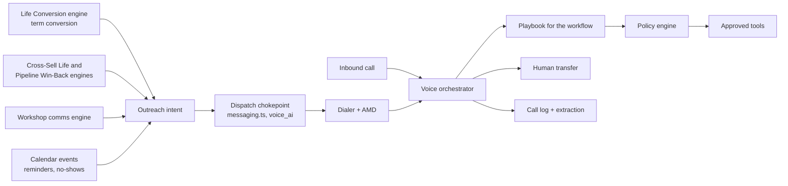

# FSOS Voice Agent — Complete Plan

September 23, 2026 · Markist Athelus

> **Reconciled with the FSOS repository on Oct 5, 2026.** Names, paths and mechanisms below now follow `docs/voice/repo-map.md`. Where the repo map left a choice to the owner, this plan uses the repo map's proposed default and marks it **(owner decision pending, Cnn)**, where Cnn is the conflict number in repo-map §12. FSOS serves one FSA practice in McKinney, TX: "office" in the original spec now means that practice.

## Summary

The FSOS Voice Agent is one orchestrator that runs 18 workflows. It ships in 12 stages: inbound first, then outbound once consent controls are proven, then optimization. Every action goes through FSOS checks. The AI never recommends products, never decides eligibility and never bypasses the compliance gate.

- **Stack:** Twilio Voice and ConversationRelay handle speech. An FSOS-owned orchestrator on a container runtime handles logic (new infrastructure; owner decision pending, C14). Claude Haiku 4.5 is the main model with a pinned fallback model, both called through FSOS's AI gateway `runGateway()` (`src/lib/ai/gateway.ts`), extended with streaming (C13).
- **Trust boundary:** the model only *requests* actions. FSOS checks identity, permissions, consent, workflow state and parameters before anything runs.
- **One pipeline:** every outbound call, text and voicemail goes through the existing dispatch chokepoint: `sendSms()`/`sendEmail()` in `src/lib/messaging.ts`, with policy from `resolveDispatchPolicy()` and `evaluateGate()`. Voice is added as a `voice_ai` channel on that chokepoint (`startVoiceCall`). There is no second send path. (`sendThroughGate` was retired; repo-map §2.)
- **Licensed humans own advice:** securities, suitability, replacement and rollover topics force a transfer to a registered person. Life-policy reviews and cross-sell only book time with a licensed professional.
- **Outbound needs proof of consent:** stages 6–11 open one workflow at a time, each after counsel classifies its consent basis and a dry run passes.

Sequence change from the earlier two-phase plan: human transfer and call logging (stages 3–4) now come before reminders, and outbound is split into six gated stages instead of one Phase 2.

## Final artifacts

There are five artifacts, all updated Sept 23, 2026 to the 12-stage sequence. The design canvas holds 31 screens; they are mockups with sample data and a temporary visual style, not built software.

| Artifact                                                                                                   | What it holds                                                                                                                    | Where                                                    |
|------------------------------------------------------------------------------------------------------------|----------------------------------------------------------------------------------------------------------------------------------|----------------------------------------------------------|
| [FSOS Voice Agent design canvas](https://claude.ai/artifact/5BJZueXJ7654nAqVLpfvQp)                        | 31 linked screens: operations, admin, insights, workspace, contacts, mobile, states, dark mode, and the workflows and stages map | Artifact                                                 |
| [FSOS Voice Agent — Build Checklist](https://claude.ai/code/artifact/f7c21e67-35f6-4661-b931-4273b05f6194) | Universal definition of done plus the checklist, sign-offs and exit criteria for stages 0–12                                     | Doc                                                      |
| This plan                                                                                                  | Scope, agent model, 12-stage sequence, compliance, tools, metrics, timeline                                                      | Doc                                                      |
| Architecture and build specification                                                                       | Twilio protocol, orchestrator, LLM layer, tool schemas, identity levels, compliance matrix, data model, tests, cost              | Research report in this conversation                     |
| Voice agent completeness audit                                                                             | Regulatory updates since the spec, P0/P1 gaps, outbound items                                                                    | FSOS project: `claude/voice-agent-completeness-audit.md` |

**Canvas screens by stage** (screen names as they appear in the navigation):

| Stage                       | Screens                                                                                                                                                                              |
|-----------------------------|--------------------------------------------------------------------------------------------------------------------------------------------------------------------------------------|
| 1 Receptionist + scheduling | Live calls, Calendar, Knowledge & scripts, Agent settings, Change approvals, Releases (flag, canary, rollback), Launch readiness, Phone numbers & routing, Contacts, Import contacts |
| 2 Known-client recognition  | Contact profile, Consent & DNC, Team & licensing                                                                                                                                     |
| 3 Human transfer            | Incoming AI transfer (mobile), Callbacks & voicemail, FSA notifications (mobile)                                                                                                     |
| 4 Logging + extraction      | Call history, Call record, Supervision review, Complaint case                                                                                                                        |
| 5 Reminders                 | Calendar, Outbound (appointment confirmations)                                                                                                                                       |
| 6–11 Outbound workflows     | Outbound campaigns, Consent & DNC, Opportunities                                                                                                                                     |
| 12 Optimization             | Analytics, Quality review, Releases (full guardrails and automatic rollback), AI governance                                                                                          |
| All                         | Workflows & production sequence, How a call flows, Empty/loading/error states, Live calls dark mode, FSA sign-in, FSA voice assistant                                                |

## Scope: 18 workflows

Each workflow is a playbook the orchestrator runs with the same tools and checks. “Consent” is the basis FSOS must find before an AI-voice outbound call. PEC means prior express consent; PEWC means prior express written consent. Counsel confirms every classification marked “likely.”

| \#  | Workflow               | What the agent does                                                                                       | Direction                        | Consent for AI voice                                             | Identity needed            | Hands to a person when                                     | Stage                     |
|-----|------------------------|-----------------------------------------------------------------------------------------------------------|----------------------------------|------------------------------------------------------------------|----------------------------|------------------------------------------------------------|---------------------------|
| 1   | New inbound lead       | Identify caller, capture needs, create or update contact, qualify on approved questions, book appointment | Inbound                          | None (caller initiated)                                          | AL0                        | Asks for advice or a person                                | 1                         |
| 2   | Existing client        | Identify client, find reason, read authorized FSOS context, resolve admin matter or route                 | Inbound                          | None                                                             | AL1–AL2                    | Securities, complaint, change request, failed verification | 2                         |
| 3   | Missed lead            | Call back leads who called or asked, confirm interest, schedule                                           | Outbound                         | PEC if returning their own inquiry; PEWC if the callback markets | AL0                        | Asks for advice                                            | 6                         |
| 4   | Appointment scheduling | Check real availability, book, confirm, trigger approved follow-ups                                       | Both                             | PEC (informational)                                              | AL0 new, AL1 existing      | No suitable slot, special request                          | 1                         |
| 5   | Appointment reminders  | Confirm, reschedule or cancel                                                                             | Outbound                         | PEC (informational)                                              | AL1                        | Wants to discuss anything beyond the time                  | 5                         |
| 6   | Annual reviews         | Contact eligible clients, explain the review, book it                                                     | Outbound                         | Likely PEWC (review leads to sales)                              | AL1                        | Product questions                                          | 7                         |
| 7   | Life-policy reviews    | Book review with a licensed professional; no product talk                                                 | Both                             | Likely PEWC if outbound                                          | AL1                        | Any product or suitability question                        | 7                         |
| 8   | Term conversion        | State verified policy and deadline facts from FSOS policy records (`household_policies.conversion_deadline`, imported), schedule advisor conversation            | Both                             | Likely PEWC if outbound (conversion is a sale)                   | AL2 before any policy fact | Any “should I” question                                    | 8                         |
| 9   | Life win-back          | Re-engage eligible prior prospects, confirm interest, schedule                                            | Outbound                         | PEWC                                                             | AL0–AL1                    | Product questions                                          | 9                         |
| 10  | Cross-sell             | Use the FSOS-identified opportunity, invite client to meet a licensed professional                        | Outbound                         | PEWC                                                             | AL1                        | Any product question                                       | 11                        |
| 11  | Workshop follow-up     | Contact registrants or attendees, answer logistics, schedule consultations                                | Outbound                         | PEWC captured on the registration form                           | AL0                        | Product questions                                          | 10                        |
| 12  | Referral follow-up     | Introduce the practice, qualify, schedule                                                                   | Inbound AI; outbound by a person | No consent from the referred person → no AI outbound             | AL0                        | Always a person for first outbound contact                 | 1 (inbound)               |
| 13  | No-show recovery       | Contact the client, reschedule                                                                            | Outbound                         | PEC (about their appointment)                                    | AL1                        | Complaint or frustration                                   | 5                         |
| 14  | Case-status calls      | Give approved status fields from FSOS case and policy records                                                        | Inbound                          | None                                                             | AL2                        | Stale data, securities, disputes                           | 2                         |
| 15  | Inbound service        | Capture request, create task or case, route                                                               | Inbound                          | None                                                             | AL1 for account items      | Changes to beneficiary, payment, address                   | 2                         |
| 16  | Human transfer         | Warm transfer with a spoken summary to the right FSA or staff member                                      | Both                             | n/a                                                              | Any                        | Always on request, “representative” or 0                   | 3                         |
| 17  | Voicemail              | Leave only the approved message where consent allows                                                      | Outbound                         | Same basis as the call it follows                                | n/a                        | Never leaves marketing without PEWC                        | 5                         |
| 18  | DNC / stop request     | Record suppression immediately, end automated outreach, confirm                                           | Both                             | n/a                                                              | None                       | Never blocked by verification                              | 1 (inbound), 6 (outbound) |

Referral follow-up differs from the brief: the referred person hasn’t consented, so the AI takes their inbound call but doesn’t make the first outbound call. A person does, or FSOS sends an approved consent-request text only if the referral itself captured SMS consent.

## Agent model

There is one voice orchestrator, not 18 bots. Each workflow is a playbook: a versioned bundle of prompt section, allowed tools, approved scripts and exit rules. Outbound work starts in existing FSOS campaign engines and the calendar, which decide *who* to contact. The voice agent only decides *how the call goes*. Per owner decision 7 (`src/lib/ai/outreach.ts:30-42`), the campaign engines own the term-conversion, cross-sell and win-back audiences; the `term_conversion` and `marketing_automation` workforce agents do not pick them.

Inbound calls and gated outbound dials both land in the same orchestrator, which loads the playbook for the workflow.

| Agent or component         | Owns                                                                                            | Existing or new                                      |
|----------------------------|-------------------------------------------------------------------------------------------------|------------------------------------------------------|
| Voice orchestrator         | Call state, turn-taking, playbook selection, firewall, handoff                                  | New (spec)                                           |
| Receptionist playbook      | Workflows 1, 2, 12 (inbound), 14, 15                                                            | New                                                  |
| Scheduling playbook        | Workflows 4, 5, 13                                                                              | New; reads the FSOS calendar                         |
| Outreach playbooks         | Workflows 3, 6–11                                                                               | New; one per workflow, each gated separately         |
| Life Conversion engine (`src/lib/life-campaign/`) | Conversion audience (`v_conversions_due`); deadlines from `household_policies` | Existing; will emit outreach intents (e.g. a new `ai_voice` touch kind) |
| Cross-Sell Life and Pipeline Win-Back engines (`src/lib/cross-sell-life/`, `src/lib/pipeline-winback/`); workshop comms engine | Cross-sell (`v_cross_sell_gaps`) and win-back (`v_pipeline_winback_due`) audiences; workshop lists | Existing; will emit outreach intents |
| Dispatch chokepoint (`sendSms`/`sendEmail` in `src/lib/messaging.ts`; `resolveDispatchPolicy`, `evaluateGate`) | Consent, DNC, suppression, quiet hours, approved template, red line, securities firewall on every outbound call, text and voicemail | Existing; extended with a `voice_ai` channel (`startVoiceCall` via `MessagingDeps.placeCall`) and voice consent purposes |
| Call intelligence          | Transcript, summary, structured outcome extraction                                              | New (stage 4)                                        |
| QA and optimization        | Sampling, scoring, test sets, release gates                                                     | New (stage 12)                                       |
| FSA voice assistant        | Internal read-only questions for FSAs                                                           | New; after stage 4                                   |

An “Outreach intent” is a record: subject, workflow, purpose (informational or telemarketing), script ID, earliest and latest time, and deadline if any. It is the only way outbound work reaches the dialer.

## Production sequence

A stage opens only when the stage before it meets its exit criteria. Stages 1–5 are inbound or informational. Stages 6–11 each need counsel sign-off on consent before any live dial. Stage 12 runs throughout and becomes the operating rhythm.

| \#  | Stage                                                        | What ships                                                                                                                                                                                                                                                                                                                                         | Workflows                        | Exit criteria to move on                                                                                                          |
|-----|--------------------------------------------------------------|----------------------------------------------------------------------------------------------------------------------------------------------------------------------------------------------------------------------------------------------------------------------------------------------------------------------------------------------------|----------------------------------|-----------------------------------------------------------------------------------------------------------------------------------|
| 1   | Inbound receptionist + appointment scheduling                | Twilio numbers set up (port or forward: owner decision pending), signed WebSocket, disclosure, approved FAQ answers, lead capture, real-time availability and booking, “representative”/0 escape, relay handling, spam and spend limits, stop requests on inbound; Change approvals for every script and answer; a minimum release path (an `automation_switches` key per workflow, canary, one-step rollback) | 1, 4, 12 (inbound), 18 (inbound) | ≥ 90% task success on 150 scripted calls; 0 compliance violations in red team; p90 ≤ 1.8 s; after-hours pilot 2 weeks clean       |
| 2   | Known-client recognition + FSOS context                      | Caller ID + carrier attestation (AL1), keypad or one-time-code step-up (AL2), authorized context reads, case status from FSOS records, service requests to tasks                                                                                                                                                                              | 2, 14, 15                        | 0 disclosures above assurance level in 500 test calls; stale-data rule verified; `licenses` table current                          |
| 3   | Human transfer + live handoff summaries                      | Transfer order, whisper summary, licensed-rep routing for securities, no-answer → voicemail + callback queue, FSA mobile alerts                                                                                                                                                                                                                    | 16                               | 98% correct targets; 100% securities to registered reps; callback SLA met 2 weeks                                                 |
| 4   | Call logging + transcription + outcome extraction            | Append-only call record, dual-channel recording, write-once archive, structured outcome (intent, result, follow-ups, consent changes, complaint flag), supervision queue                                                                                                                                                                           | All inbound                      | Extraction accuracy ≥ 95% on labeled set; archive verified; supervision queue staffed                                             |
| 5   | Appointment reminders + rescheduling                         | Outbound core, built once and reused by stages 6–11: outreach-intent queue, `voice_ai` channel on the dispatch chokepoint, dialer with pacing and answering-machine detection. Informational calls on it: confirmations, reschedules, cancels, no-show recovery; approved voicemail VM-INF-2                                                                 | 5, 13, 17                        | Counsel confirms informational classification; opt-out and voicemail scripts approved; 0 calls outside calling windows in dry run |
| 6   | Consent-controlled outbound calling                          | Number reputation (attestation, CNAM, registration), keypad opt-out, consent capture flows, consent inventory by purpose, missed-lead callbacks                                                                                                                                                                                                    | 3, 18 (outbound)                 | Consent inventory by purpose complete; spam-label monitoring live; FCC revocation rules re-checked after the Sept 30, 2026 vote   |
| 7   | Annual-review outreach                                       | Review invitations and life-policy review booking with licensed professionals                                                                                                                                                                                                                                                                      | 6, 7                             | Counsel classification; PEWC coverage measured; firewall bait set passes 100%                                                     |
| 8   | Term-conversion outreach                                     | Deadline-driven calls from Life Conversion engine intents; deadline re-read from `household_policies` at dial time                                                                                                                                                                                                                                                                  | 8                                | Deadline accuracy 100% vs FSOS policy records in dry run; licensed-rep capacity confirmed                                               |
| 9   | Life win-back                                                | Re-engagement of eligible prior prospects                                                                                                                                                                                                                                                                                                          | 9                                | PEWC only; state rule packs; suppression of anyone who revoked                                                                    |
| 10  | Workshop follow-up                                           | Registrant and attendee calls, logistics answers, consultation booking                                                                                                                                                                                                                                                                             | 11                               | Registration form captures PEWC naming the seller                                                                                 |
| 11  | Cross-sell outreach                                          | Invitations based on FSOS-identified opportunities to meet a licensed professional                                                                                                                                                                                                                                                                 | 10                               | No product claims in any script; firewall and output guard pass                                                                   |
| 12  | AI optimization, QA, supervision, outcome-driven improvement | Quality sampling, test-set growth, full Releases screen with guardrails and automatic rollback, analytics, governance reviews                                                                                                                                                                                                                      | All                              | Ongoing; quarterly governance review signed off                                                                                   |

## Compliance rules

The FCC treats AI-generated voices as artificial voice under the TCPA, so every AI outbound call and AI voicemail needs consent that matches its purpose. These rules apply to every workflow. They are engineering controls, not legal advice. Counsel signs off per workflow.

| Rule                                             | Applies to               | How FSOS enforces it                                                                                                                                                            |
|--------------------------------------------------|--------------------------|---------------------------------------------------------------------------------------------------------------------------------------------------------------------------------|
| AI and recording disclosure before anything else | Every call               | Non-interruptible opening script DISC-v3; truthful answer to “are you a person?”                                                                                                |
| Consent matches purpose | Outbound 3, 5–11, 13, 17 | The dispatch chokepoint checks `voice_ai` consent by purpose at dial time (informational PEC, telemarketing PEWC). Consent lives in the existing stores: `consents` (`call` channel), new voice purposes on `comm_consent_purposes`, PEWC evidence in `comm_contact_consents` (C10) |
| Stop means stop                                  | All                      | “Stop calling,” keypad opt-out or STOP text records suppression immediately and cancels queued intents; confirmation spoken; revocation of telemarketing ends all telemarketing. Today an SMS STOP revokes every purpose on that channel; voice revocation scope is pending counsel (C11) |
| Designated opt-out methods                       | Outbound                 | Keypad opt-out plus disclosure in every AI call and text (FCC draft order, vote Sept 30, 2026; re-check after)                                                                  |
| Calling windows | Outbound | FSOS floor: 9:00 AM–8:00 PM recipient-local, every day, for every `voice_ai` call (no purpose exemption); marketing calls held until noon on Sunday. Time zone from ZIP and area code; when they differ the call must be in window in both; an unresolved US number must be in window in every continental zone. Operator windows may narrow this floor, never widen it (CLAUDE.md; `src/lib/compliance/guardrail.ts:65`) |
| DNC and reassigned numbers | Outbound | Internal DNC (`dnc_entries`, `call` and `all` rows) plus national DNC and reassigned-number checks before every dial. The last two are new integrations (C12) |
| Voicemail                                        | 17                       | Only approved scripts; marketing voicemail only with PEWC; otherwise hang up and create a task                                                                                  |
| No advice                                        | All                      | Rule-first firewall, classifier, output guard; forced transfer to a registered person for securities, suitability, replacement, rollover                                        |
| Verified facts only | 8, 14 | Policy facts and deadlines come from FSOS records (`household_policies`, imported lists); missing, expired or stale data is not spoken. The freshness rule is owner decision pending (C15) |
| Identity before disclosure                       | 2, 8, 14, 15             | Assurance levels AL0–AL3; keypad digits never reach the model                                                                                                                   |
| Vulnerable callers                               | All                      | Exploitation or confusion cues → person + flag; trusted contact per FINRA guidance                                                                                              |
| Complaints                                       | All                      | Detection → case, acknowledgment, principal decides reportability                                                                                                               |
| Supervision and records                          | All                      | Every turn, tool request and policy decision logged; write-once archive (new; C7); retention per counsel                                                                                  |
| AI governance                                    | All                      | Register of components, vendor reviews, test evidence (TDI Bulletin B-0003-26)                                                                                                  |
| No biometrics                                    | All                      | No voiceprints; vendor terms confirm (Texas CUBI)                                                                                                                               |

## Tools and data additions

The spec’s 14 tools cover stages 1–4. The new workflows need nine more tools and five data changes. All of them go through the same policy engine, idempotency keys and audit log.

| Tool                     | Used by              | Minimum identity   | Key checks                                                                               |
|--------------------------|----------------------|--------------------|------------------------------------------------------------------------------------------|
| `createOrUpdateContact`  | 1, 3, 12             | AL0                | Duplicate match by phone or email + name; no overwrite of verified fields                |
| `qualifyLead`            | 1, 3, 12             | AL0                | Approved question set only; answers stored as structured fields                          |
| `cancelAppointment`      | 4, 5                 | AL1 + number match | Reason required; frees the slot                                                          |
| `confirmAppointment`     | 5                    | AL1                | Only for the appointment the call was about                                              |
| `recordSuppression`      | 18                   | None               | Immediate; scope by channel and purpose; cancels queued intents                          |
| `leaveApprovedVoicemail` | 17                   | n/a                | Script ID must match the consent basis; answering-machine result required                |
| `createServiceCase`      | 15                   | AL1                | Category from a fixed list; changes to beneficiary, payment or address route to a person |
| `extractCallOutcome`     | All (system)         | n/a                | Runs after the call; schema-validated; low confidence → human review                     |
| `createOutreachIntent`   | 3, 5–11, 13 (system) | n/a                | Only FSOS campaign engines and calendar events create intents; the model can’t                     |

Tools wrap existing FSOS functions rather than writing tables directly (repo-map §4, §5):

| Tool | Existing FSOS function |
|---|---|
| `getAppointmentAvailability` | `computeSlotsForType` (`src/lib/booking/slots.ts:58`) |
| `scheduleAppointment` | New authenticated entry reusing `src/lib/booking/book.ts`; double-booking is blocked by the database exclusion constraint |
| `rescheduleAppointment`, `cancelAppointment` | `src/lib/booking/manage.ts:126`, `:89` |
| `confirmAppointment` | New; needs a `confirmed` appointment status (C17) |
| `createFollowUpTask` | `work_tasks`; `createAppointmentFollowupTask` (`src/lib/appointments/service.ts:148`) |
| `recordSuppression` | `recordChannelOptOut` (`src/lib/comms/opt-out.ts:157`), extended for `voice_ai` |
| `sendApprovedSMS` | `sendMessage` → dispatch chokepoint |
| `createOrUpdateContact` | `contacts` dedupe keys and `src/lib/import/` matching |
| Data change                      | Purpose                                                                              |
|----------------------------------|--------------------------------------------------------------------------------------|
| `outreach_intents` table   | Queue of who to call, why, script, window, deadline, gate decision                   |
| `call_outcomes` table      | Structured result per call: intent, result, follow-ups, flags, confidence            |
| `playbooks` table          | Versioned playbooks with allowed tools and scripts; tied to releases                 |
| `comm_consent_purposes` voice purposes | Add AI-voice purposes (e.g. informational and marketing) so consent and revocations can be scoped by purpose (FCC draft; C10) |
| `confirmed` appointment status | Lets `confirmAppointment` record a confirmation (C17) |
| Channel CHECKs widened to `voice_ai` where calls are logged | `comm_messages`, `comm_templates`, `comm_conversations`, or a separate call table instead (C2) |

New tables go in `public` with the FSOS RLS pattern unless the owner chooses a separate `voice` schema (C6). Consent is not stored in a new `consent_records` table, and audit is not stored in a new `audit_log`: both reuse the existing stores and `writeAudit()`.
| Trusted contact on contacts      | Name, relationship, when it may be used                                              |

## Quality, supervision and metrics

Each stage is measured against targets before the next one opens. The targets below are starting points (ASSUMPTION) to tune after the pilot.

| Metric                                 | Target                 | Stages             | Where it shows                |
|----------------------------------------|------------------------|--------------------|-------------------------------|
| Scripted-call task success             | ≥ 90%                  | 1–5, each playbook | Launch readiness              |
| Compliance violations in red team      | 0                      | All                | Launch readiness              |
| Disclosures above assurance level      | 0                      | 2+                 | Launch readiness, Call record |
| Voice-to-voice response p90            | ≤ 1.8 s                | All                | Analytics, Releases           |
| Correct transfer target                | ≥ 98%; securities 100% | 3+                 | Analytics                     |
| Outcome extraction accuracy            | ≥ 95%                  | 4+                 | Quality review                |
| Callback within SLA                    | ≥ 95%                  | 3+                 | Callbacks & voicemail         |
| Resolved by AI (inbound)               | ≥ 55%                  | 1–4                | Analytics                     |
| Appointment show rate after reminders  | Baseline +10 pts       | 5                  | Analytics                     |
| Stop requests honored within one call  | 100%                   | 1, 6+              | Consent & DNC                 |
| Calls outside calling windows          | 0                      | 5+                 | Outbound campaigns            |
| Booked meetings per 100 outreach calls | Baseline per workflow  | 6–11               | Analytics                     |

Supervision rhythm: principals review every firewall, complaint, consent change and failed-verification item; QA scores 5% of AI calls plus all flagged calls weekly; governance review every quarter.

## Timeline and team

Stages 1–4 take about 14 weeks; all 12 stages open by about week 36. These estimates (ASSUMPTION) are for the team below and slip mainly on counsel decisions and number porting.

| Weeks | Stage                            | Note                                                                                          |
|-------|----------------------------------|-----------------------------------------------------------------------------------------------|
| 0–2   | Foundations                      | Twilio AI addendum, number porting order, infra, database, signature check, first Claude call |
| 2–8   | 1 Receptionist + scheduling      | After-hours pilot at the practice from week 6                                                   |
| 6–10  | 2 Known-client recognition       | Needs the `licenses` table current and the policy-record freshness rule (C15)                                          |
| 8–12  | 3 Human transfer                 | Callback queue and FSA alerts ship with it                                                    |
| 9–14  | 4 Logging + extraction           | Runs in parallel with 3; go/no-go for the practice, all hours, at week 14                       |
| 14–18 | 5 Reminders + rescheduling       | First outbound; informational only                                                            |
| 18–24 | 6 Consent-controlled outbound    | Number reputation, consent capture (the dialer ships in stage 5)                              |
| 24–27 | 7 Annual reviews                 | Gated by counsel                                                                              |
| 26–29 | 8 Term conversion                | Depends on licensed-rep capacity                                                              |
| 29–31 | 9 Life win-back                  |                                                                                               |
| 31–33 | 10 Workshop follow-up            | Registration form must capture PEWC first                                                     |
| 33–36 | 11 Cross-sell                    |                                                                                               |
| 11 →  | 12 Optimization, QA, supervision | Starts with the first live calls; permanent                                                   |

| Role                                            | Allocation               |
|-------------------------------------------------|--------------------------|
| Backend engineers (orchestrator, tools, dialer) | 2–3                      |
| Frontend engineer (FSOS screens)                | 1                        |
| QA / evaluation engineer                        | 1                        |
| Compliance lead                                 | ~25%                     |
| Registered principal (supervision)              | ~10%, rising with volume |
| Counsel                                         | Per-stage sign-offs      |
| Practice operator (product owner; the FSA) | Ongoing                  |

## Open decisions

The first decisions below block stage 0–2 dates; the rest block individual stages. Items added on Oct 5, 2026 come from the repo map (C-numbers).

- [ ] Port or keep forwarding the practice's number(s); a forwarded number cannot reach AL1 by caller ID — operator, before week 2
- [ ] Source for licenses, registrations and on-duty schedule — engineering + compliance, before week 6
- [ ] Policy facts: obtain policy-system read access, or confirm imported `household_policies` records plus a freshness rule (C15) — owner + compliance, before week 6
- [ ] Twilio written confirmation of max call length, concurrency and data locations — operator, before pilot
- [ ] Recording-consent wording for all-party states and retention schedule — counsel, before pilot
- [ ] Consent classification per outbound workflow (3, 5–11, 13, 17) — counsel, before each stage
- [ ] Revocation scope and opt-out methods after the FCC’s Sept 30, 2026 vote — counsel, before stage 6
- [ ] Whether existing consents cover AI voice or need re-capture — counsel, before stage 6
- [ ] Complaint reportability procedure for AI-detected complaints — compliance, before stage 4
- [ ] Vendor terms: no voiceprints, data retention (Twilio, speech providers, Anthropic) — compliance, before pilot
- [ ] Colorado scope under SB 26-189 if any Colorado residents are served — counsel
- [ ] Confirm the campaign engines (not the `term_conversion` / `marketing_automation` agents) emit outreach intents, per owner decision 7 (C3) — owner, before stage 5
- [ ] Confirm "office" means the single McKinney practice, or name the offices this plan was written for (C4) — owner, before stage 0
- [ ] Approve the container runtime and Redis for the orchestrator, and how it reuses `messaging.ts`, `gateway.ts` and `writeAudit` (C14) — owner, before stage 0
- [ ] National DNC and reassigned-number vendors (C12) — ops + engineering, before stage 5
- [ ] Hash chain on `audit_log` versus a voice-only chained table; write-once archive (C7) — engineering + counsel, before stage 4
- [ ] Voice consent purposes and PEWC evidence model (C10) — counsel + engineering, before stage 5
- [ ] FSA mobile alerts: web push (PWA) or SMS through the chokepoint (C21) — owner, before stage 3
- [ ] Model IDs and pinning policy (the gateway default `claude-sonnet-5` is an undated alias) (C26) — engineering, before stage 0
- [ ] Dark mode: FSOS has none today (`docs/archetypes.md:87`, P2); build it platform-wide or drop it from the voice screens (C20) — design + owner, before frontend build

## What the agent never does

These are out of scope for every stage. A request for any of them ends in a transfer to a person or a task, never an attempt.

- Recommend a product, investment, annuity or replacement, or compare products
- Decide suitability, risk tolerance, eligibility, pricing or underwriting
- Move money or place a securities transaction
- Change a beneficiary, payment method or address on its own
- Advance a regulated opportunity stage (it can link a call or meeting to the opportunity)
- Use voiceprints or any voice biometric
- Send anything outside the dispatch chokepoint (`src/lib/messaging.ts`)
- NIGO (not-in-good-order) document chasing, in any form: no workflow, tool, campaign, screen or stage gate

**Tools that must never exist.** `recommendInvestment`, `recommendAnnuity`, `selectProduct`, `determineSuitability`, `moveMoney`, `changeBeneficiary`, `approveUnderwriting`. A code review that finds one blocks the stage.

## Handoff packet

Every transfer, and every callback created from a failed transfer, carries the same packet. The whisper summary is read from it.

| Field                | What it holds                                                                                                          |
|----------------------|------------------------------------------------------------------------------------------------------------------------|
| Caller and assurance | Who is calling and the current level (AL0–AL3)                                                                         |
| Reason for call      | Main intent and workflow                                                                                               |
| What the AI did      | Verification, facts read, appointment actions, tasks created                                                           |
| Why it handed off    | Caller asked, securities, suitability, rollover, complaint, failed verification, unsupported action or system fallback |
| Facts already stated | Only values read from source systems, with their source                                                                |
| Next human action    | Continue the conversation, licensed analysis, resolve the complaint or finish the service request                      |

## Testing and release

Every stage runs every applicable layer. Mocked tests and live integration tests are reported separately.

| Layer               | Covers                                                                                              |
|---------------------|-----------------------------------------------------------------------------------------------------|
| Unit                | Playbook logic, validators, rule helpers, outcome schemas, date and calling-window helpers          |
| Policy              | Assurance, role and partner-agency scoping, consent, DNC, calling window, licensing, tool permission         |
| Integration         | Twilio to orchestrator, policy-system reads, calendar, consent, licensing, outbound gate            |
| Voice scenarios     | Silence, interruptions, ambiguity, corrections, asking for a person, keypad, noise, changed mind    |
| Compliance red team | Rollover, suitability, replacement, securities, product comparison, data fishing, stop requests     |
| Failure drills      | Model outage, tool outage, dropped connection, concurrency cap, stale calendar, stale policy data   |
| Browser end-to-end  | Each stage's screens, permissions, and empty, loading, error, degraded and permission-denied states |
| Performance         | p50, p90 and p99 turn latency at 2× expected peak; transfer and queue behavior                      |
| Regression          | Every production defect and QA failure becomes a permanent test case                                |

Release steps for every change, from stage 1 on:

1.  Build behind an `automation_switches` key for the workflow (off by default)
2.  Run automated tests and the scripted-call suite
3.  Run the compliance red-team suite
4.  Run in shadow mode where it applies
5.  Get the required approvals in Change approvals
6.  Canary to verified test recipients or 10% of calls
7.  Watch guardrails and business metrics
8.  Expand only while exit criteria hold
9.  Keep the previous version ready for one-step rollback

Stage 1 ships the minimum path for this (flag, canary, rollback, approvals). Stage 12 adds the full Releases screen with automatic rollback on guardrail failure.

## Revision notes

Sept 23, 2026: merged the useful parts of an outside review (a ChatGPT-generated package built from this plan): the exclusions and prohibited tools, the handoff packet, the test layers and release steps, and a stricter status and evidence protocol in the build checklist. Fixed two sequencing errors in this plan: Change approvals, Releases (minimum path) and Launch readiness now ship in stage 1 rather than stage 12, and the dialer moved from stage 6 to stage 5, where the first outbound calls happen.

Oct 5, 2026: reconciled with the FSOS repository (`docs/voice/repo-map.md`). Replaced `sendThroughGate` with the dispatch chokepoint; intents now come from the campaign engines (owner decision 7); per-office controls now apply to the single practice; the calling window follows the FSOS 9:00 AM–8:00 PM floor; the `voice` consent and audit tables were dropped in favor of the existing stores; policy facts come from FSOS records; model calls go through `runGateway()`. Open choices are marked owner decision pending and listed under Open decisions.

## Sources

- [FCC draft consent-revocation order summary (The CommLaw Group)](https://commlawgroup.com/2026/fcc-recasts-tcpa-consent-revocation-rules/)
- [TDI Commissioner’s Bulletin B-0003-26](https://tdi.texas.gov/bulletins/2026/b-0003-26.html)
- [Colorado SB 26-189 (Seyfarth)](https://www.seyfarth.com/news-insights/colorado-enacts-artificial-intelligence-replacement-law.html)
- [FINRA Regulatory Notice 26-02](https://www.finra.org/rules-guidance/notices/26-02)
- [Twilio ConversationRelay TwiML reference](https://www.twilio.com/docs/voice/twiml/connect/conversationrelay)
- [Claude models overview](https://platform.claude.com/docs/en/models/overview)
